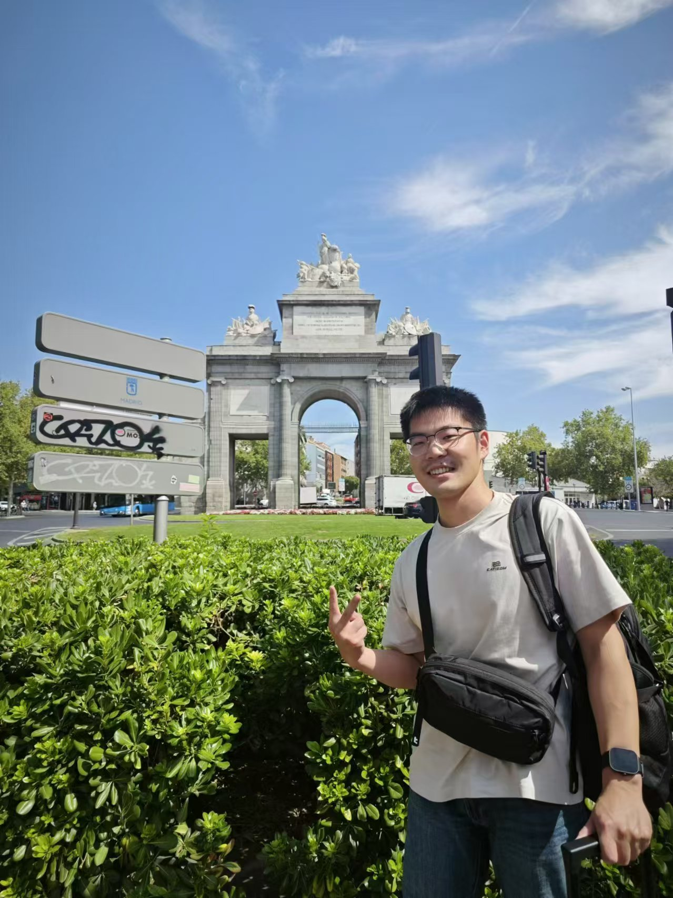

# Yunkun Liao (廖云坤)

## About Me

Hi! I am Yunkun Liao (廖云坤), a last-year Ph.D. student at ICT, CAS, advised by Prof. [Guihai Yan](http://english.ict.cas.cn/people/scien/bln/202303/t20230321_328593.html). I research the intersection between computer 
 network and computer architecture. My career goal is to become a chip and system architect, and I am working diligently toward that.

[Google Scholar](https://scholar.google.com/citations?user=6ITn_W8AAAAJ&hl=en) 

I am expected to finish my thesis defense in 2025/11 and graduate in 2026/01. I am looking for jobs. FEEL FREE TO CONTACT ME!

**He who has a why to live can bear almost any how.**

## Research Interests
* Programmable Network Devices: SmartNIC, Data Processing Unit (DPU)
* Domain-specific Accelerators
* Scale Up/Out Interconnect (e.g., UEC, UALink) for Emerging Workloads like LLM

## Education
* Sep. 2020 - Present: **State Key Laboratory of Processors, Institute of Computing Technology, Chinese Academy of Sciences**

   Ph.D. student in Computer Systems and Architecture

* Sep. 2016 - Jun. 2020: **Shanghai Jiao Tong University, School of Electronic Information and Electrical Engineering**

   B.E. in Microelectronics Science and Engineering

## Industry Experience
* Jan. 2021 - Jun. 2022: **YUSUR Technology Co., Ltd.**

   FPGA/IC engineer for RDMA NIC subsystem.
* Apr. 2025 - Jun. 2025: **YUSUR Technology Co., Ltd.**

   RDMA driver deverloper for NP-based RDMA NIC

## Publications
### Emerging Networking Hardware
- **GLSVLSI 2023** ["Optimize the TX Architecture of RDMA NIC for Performance Isolation in the Cloud Environment"](https://dl.acm.org/doi/10.1145/3583781.3590276), **Yunkun Liao**, Jingya Wu, Wenyan Lu, Xiaowei Li, Guihai Yan. [Code](https://github.com/liaoyunkun/RDMA-NIC-Isolation-Research) Some parts of this paper are used in commodity DPU Chip, [Slides](./glsvlsi_2023_pre.pdf)
- **TC** ["DPU-Direct: Unleashing Remote Accelerators via Enhanced RDMA for Disaggregated Datacenters"](https://ieeexplore.ieee.org/abstract/document/10536912),  **Yunkun Liao**, Jingya Wu, Wenyan Lu, Xiaowei Li, Guihai Yan. [Slides](./DPU-Direct-Intro.pdf)
- **Euro-PAR 2024** ["Efficient RNIC Cache Side-channel Attack Detection through DPU-driven Architecture"](https://link.springer.com/chapter/10.1007/978-3-031-69766-1_1), **Yunkun Liao**, Jingya Wu, Wenyan Lu, Xiaowei Li, Guihai Yan. [Slides](./europar-2024-rcsca.pdf)
- **Euro-PAR 2024** ["Athena: Add More Intelligence to RMT-based Network Data Plane with Low-bit Quantization"](https://link.springer.com/chapter/10.1007/978-3-031-69766-1_18), **Yunkun Liao**, Hanyue Lin, Jingya Wu, Wenyan Lu, Huawei Li, Xiaowei Li and Guihai Yan. [Code](https://github.com/liaoyunkun/dpu-driven-scadet/tree/master), [Slides](./europar-2024-athena.pdf)
- **CCF-THPC** ["FUS: FPGA-based Universal Sketch with Homogeneous and Heterogeneous Memory Architectures"](https://link.springer.com/article/10.1007/s42514-025-00222-5) **Yunkun Liao**, Jingya Wu, Wenyan Lu, Huawei Li, Xiaowei Li, Guihai Yan.
- **ICCAD 2025** (To appear) "SNO: Securing Network Function Offloading on FPGA-based SmartNICs in Untrusted Clouds." **Yunkun Liao**, Jingya Wu, Wenyan Lu, Hang Lu, Xiaowei Li, Guihai Yan.
- (In submission to journal) "T-SNIC: Architecting Trusted SmartNIC for Confidential End-host In-Network Computing"  **Yunkun Liao**, Jingya Wu, Wenyan Lu, Hang Lu, Xiaowei Li, Guihai Yan.

### Domain-specific Accelerator
- **FPL 2020** ["A Winograd-based CNN accelerator with a fine-grained regular sparsity pattern"](https://ieeexplore.ieee.org/document/9221628), Tao Yang, **Yunkun Liao**, Jianping Shi, Yun Liang, Naifeng Jing, Li Jiang. [Code, Pruning Algorithm](https://github.com/liaoyunkun/Winograd-NN-Prune-FPL-2020)
- **DAC 2024** ["PHD: Parallel Huffman Decoder on FPGA for Extreme Performance and Energy Efficiency"](https://dl.acm.org/doi/10.1145/3649329.3655967), **Yunkun Liao**, Jingya Wu, Wenyan Lu, Xiaowei Li, Guihai Yan. [Slides](./dac_2024_pre.pdf)

## Chinese Patents
- [RDMA网卡发送队列的性能隔离方法和RDMA网卡](./patent_1.png)
- [一种基于智能网卡的存储方法及系统](./patent_2.png)
- [一种队列对状态管理方法及系统](./patent_3.png)
- [一种基于硬件多线程的RDMA数据发送队列管理方法及装置](./patent_4.png)
- [一种基于远程直接内存访问的队列页表管理方法及装置](./patent_5.png)

## Whitepapers
- [Technical White Paper of Data Processing Unit, in Chinese](./DPU-whitepaper-publish-2021.pdf): This is the first DPU whitepaper in China.
- [DPU Benchmark Methodology and Implementation, in Chinese](./DPU_Benchmark.pdf): This is China's first DPU evaluation whitepaper.

## Honors and Awards
* [CCF HPC China 2024 Outstanding Research Paper](https://ccf.org.cn/hpcchina2024/general_2187)
* 2023-2024 UCAS Merit Student
* 2024-2025 UCAS Top Merit Student 
  
## Services

* Reviewer: BenchCouncil Transactions on Benchmarks, Standards and Evaluations; IEEE Transactions on Information Forensics and Security; ISCAS 2025

## Talks

* [CCF Chip 2022](./ccf_chip_2022.jpg), Nanjing
* DAC 2024, San Francisco
* EuroPar 2024, Madrid
* CCF HPC China 2024, Wuhan

## Contact Me

* Email: [liaoyunkun20@mails.ucas.ac.cn](mailto:liaoyunkun20@mails.ucas.ac.cn)
* Postal Address: No.6 Kexueyuan South Road Zhongguancun, Haidian District Beijing, China 100190

## Misc
- Books I like: 《Jean-Christophe》,《Really Achieving Your Childhood Dreams》,《The Snows of Kilimanjaro》,《Minimalism》,《Decisive Moments in History》, 《Educated》
- I share technical blogs on [Zhihu](https://www.zhihu.com/people/qi-ming-zi-zhen-nan-38-2/posts)

---

