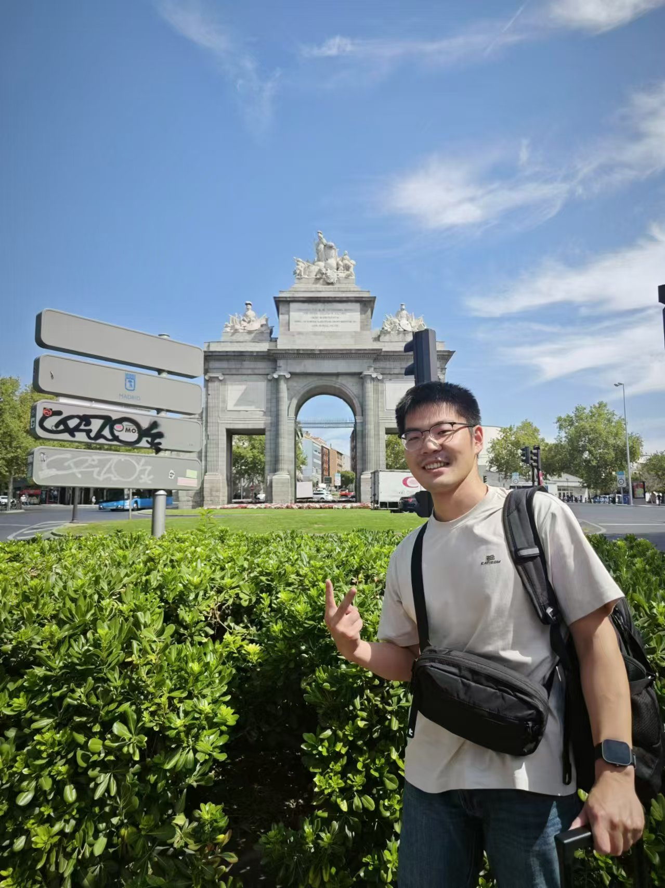

## About Me

Hi! I am Yunkun Liao (廖云坤), a 5th year Ph.D Student at ICT, CAS, advised by Prof. [Guihai Yan](http://english.ict.cas.cn/people/scien/bln/202303/t20230321_328593.html). Currently, I am doing research in the intersection between computer 
 network and computer architecture (computing-network convergence, "算网融合" in Chinese). I am expected to graduate in 2026/01, planing to find a postdoc position abroad.

[Google scholar](https://scholar.google.com/citations?user=6ITn_W8AAAAJ&hl=en) **I hope to continuously improve the quality of my research.**

For research, try to **think big, aim high, act bold and make positive changes**.

For people around me, try to make **Good Thoughts, Good Words, Good Deeds**.

For the life journey, I believe **He who has a why to live can bear almost any how.** (Friedrich Nietzsche).

## Education
* Sep. 2020 - Present: **University of Chinese Academy of Sciences**

   Ph.D Student in Computer Systems and Architecure

* Sep. 2016 - Jun. 2020: **Shanghai Jiao Tong University**

   B.E. in Microelectronics Science and Engineering

## Industry Experience
* Jan. 2021 - Jun. 2022: **YUSUR Technology Co., Ltd.**

   FPGA/IC engineer for RDMA NIC subsystem. Related products: [FLEXFLOW®-2100R RDMA](https://www.yusur.tech/product/flexflow/flexflow2100r), [K2-Pro DPU Chip, full-fledged DPU, taped out in TSMC 28nm](https://www.yusur.tech/dpu/K2-Pro).
  
## 算网融合
### 网中有算
数据中心Scale-Out, Disaggregation是未来算力增长的关键路径，网络基础设施应足够强、以释放大规模算力。
（对网络基础设施“强”的定性：释放大规模算力需要网络基础设施具备“远程访问本地化”、“硬件资源虚拟化”、“安全防护内联化”，“运行维护集约化”。）
### 算中有网
一种新的计算编排方式，打破传统算力设备和网络设备的边界，在网络设备中融合计算和传输以提升计算效率，实现在网计算。

## Publications
### Emerging Networking Hardware
- **GLSVLSI 2023** ["Optimize the TX Architecture of RDMA NIC for Performance Isolation in the Cloud Environment"](https://dl.acm.org/doi/10.1145/3583781.3590276), **Yunkun Liao**, Jingya Wu, Wenyan Lu, Xiaowei Li, Guihai Yan. [Code](https://github.com/liaoyunkun/RDMA-NIC-Isolation-Research)
- **TC** ["DPU-Direct: Unleashing Remote Accelerators via Enhanced RDMA for Disaggregated Datacenters"](https://ieeexplore.ieee.org/abstract/document/10536912),  **Yunkun Liao**, Jingya Wu, Wenyan Lu, Xiaowei Li, Guihai Yan. 
- **Euro-PAR 2024** ["Efficient RNIC Cache Side-channel Attack Detection through DPU-driven Architecture"](https://link.springer.com/chapter/10.1007/978-3-031-69766-1_1), **Yunkun Liao**, Jingya Wu, Wenyan Lu, Xiaowei Li, Guihai Yan. 
- **Euro-PAR 2024** ["Athena: Add More Intelligence to RMT-based Network Data Plane with Low-bit Quantization"](https://link.springer.com/chapter/10.1007/978-3-031-69766-1_18), **Yunkun Liao**, Hanyue Lin, Jingya Wu, Wenyan Lu, Huawei Li, Xiaowei Li and Guihai Yan. 

### Domain-specific Accelerator
- **FPL 2020** ["A Winograd-based CNN accelerator with a fine-grained regular sparsity pattern"](https://ieeexplore.ieee.org/document/9221628), Tao Yang, **Yunkun Liao**, Jianping Shi, Yun Liang, Naifeng Jing, Li Jiang. [Code, Pruning Algorithm](https://github.com/liaoyunkun/Winograd-NN-Prune-FPL-2020)
- **DAC 2024** "PHD: Parallel Huffman Decoder on FPGA for Extreme Performance and Energy Efficiency", **Yunkun Liao**, Jingya Wu, Wenyan Lu, Xiaowei Li, Guihai Yan. 

## Authorized Patents
- [RDMA网卡发送队列的性能隔离方法和RDMA网卡](https://www.qixin.com/company-detail/patent/434e3230323331303736323132332e38/54)

## Whitepapers
- [Technical White Paper of Data Processing Unit, in Chinese](./DPU-whitepaper-publish-2021.pdf): This is the first DPU whitepaper in China.
- [DPU Benchmark Methodology and Implementation, in Chinese](./DPU_Benchmark.pdf): This is the first DPU evaluation whitepaper in China.

## Honors and Awards
* CCF HPC China 2024 Outstanding Research Paper
* 2023 UCAS Merit Student
  
## Services

* Reviewer: BenchCouncil Transactions on Benchmarks, Standards and Evaluations; The Journal of Supercomputing; IEEE Transactions on Information Forensics and Security

## Contact Me

* Email: [liaoyunkun20s@ict.ac.cn](mailto:liaoyunkun20s@ict.ac.cn)
* Postal Address: No.6 Kexueyuan South Road Zhongguancun,Haidian District Beijing,China 100190

## Misc
- Books I like: 《Jean-Christophe》，《Really Achieving Your Childhood Dreams》，《The Snows of Kilimanjaro》，《Minimalism》，《Decisive Moments in History》
- Role Models: Prof. Randy Pausch, Prof. Onur Multu, My advisor.

生命，一次又一次轻薄过
轻狂不知疲倦
　　 ——题记

我听见回声，来自山谷和心间
以寂寞的镰刀收割空旷的灵魂
不断地重复决绝，又重复幸福
终有绿洲摇曳在沙漠
我相信自己
生来如同璀璨的夏日之花
不凋不败，妖冶如火
承受心跳的负荷和呼吸的累赘
乐此不疲
　　

我听见音乐，来自月光和胴体
辅极端的诱饵捕获飘渺的唯美
一生充盈着激烈，又充盈着纯然
总有回忆贯穿于世间
　　
我相信自己
死时如同静美的秋日落叶
不盛不乱，姿态如烟
即便枯萎也保留丰肌清骨的傲然
玄之又玄

我听见爱情，我相信爱情
爱情是一潭挣扎的蓝藻
如同一阵凄微的风
穿过我失血的静脉
驻守岁月的信念

我相信一切能够听见
甚至预见离散，遇见另一个自己
而有些瞬间无法把握
任凭东走西顾，逝去的必然不返
　　
请看我头置簪花，一路走来一路盛开
频频遗漏一些，又深陷风霜雨雪的感动

般若波罗蜜，一声一声
生如夏花，死如秋叶
还在乎拥有什么

---

